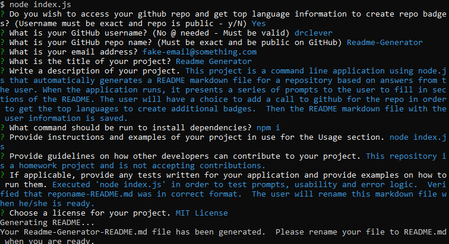

# Readme Generator

[](https://opensource.org/licenses/MIT)   


## Description

This project is a command line application using node.js that automatically generates a README markdown file for a repository based on answers from the user. When the application runs, it presents a series of prompts to the user to fill in sections of the README. The user will have a choice to add a call to github for the repo in order to get the top languages to create additional badges.  Then the README markdown file with the user information is saved. 

### Built with
* Javascript
* [Node.js](https://nodejs.org/en/)
* [npm axios](https://www.npmjs.com/package/axios)
* [npm inquirer](https://www.npmjs.com/package/inquirer)
* [Visual Studio Code](code.visualstudio.com)
* [Github API](https://developer.github.com/v3/)


## Table of Contents
* [Installation](#installation)
* [Usage](#usage)
* [License](#license)
* [Contributing](#contributing)
* [Tests](#tests)
* [Questions](#questions)


## Installation

To install dependencies, run the following:

```
npm i
```


## Usage

node index.js

When the user runs node index.js, the application uses the inquirer package to prompt him/her in the command line with a series of questions about the repo GitHub and his/her project.

If user answered yes to the question if he/she wanted to use the Github API to access their repo, the application will take the user's responses and use axios to obtain the top language(s) for the repo to create badges. From there, the application will generate a markdown README based on the user's responses to the inquirer prompts.  The README will also include the license badge selected during the prompts.

Finally, the fs.writeFile is used to generate the temporary README. The file that is saved will be the repo name plus README (i.e.  Readme-Generator-README).  This is done so that the current README file is not overwritten.  The user can rename the generated file when appropriate.


### Link to video that you can download
[Readme-Generator Video Link](https://drive.google.com/drive/folders/1gDWOajvxyR4BfVlULvKGEXwxw_XOYI0Z?usp=sharinghttps://drive.google.com/drive/folders/1gDWOajvxyR4BfVlULvKGEXwxw_XOYI0Z?usp=sharing)


### Readme Generator Image



## License


This repository is licensed under the MIT License.
[](https://opensource.org/licenses/MIT)


## Contributing

This repository is a homework project and is not accepting contributions.


## Tests

To run tests, run the following:
```
node index.js
```
Executed 'node index.js' in order to test prompts, usability and error logic.  Verified that Readme-Generator-README md was in correct format.  The user will rename this markdown file when he/she is ready.


## Questions

Questions about this repository? Please contact me at [fake-email@something.com](mailto:fake-email@something.com). View more of my work in GitHub at [drclever](https://github.com/drclever)